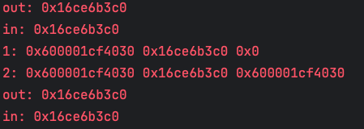
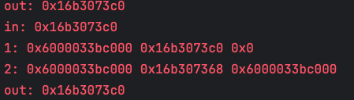

## 链表

```cpp
void insert_at_head(Node **head, int data) {
  // Node **head = &head;
  // std::cerr << "in: " << head << std::endl;
  Node *new_node = (Node *)malloc(sizeof(Node));  // 分配内存给新节点
  if (new_node == nullptr) {
    printf("Memory allocation failed!\n");
    return;
  }

  new_node->data = data;       // 设置数据
  new_node->next = *head;      // 新节点的 next 指向当前头节点
  // std::cerr << "1: " << new_node << " " << head << " " << *head << std::endl;
  *head = new_node;            // 更新头指针，指向新节点
  // std::cerr << "2: " << new_node << " " << head << " " << *head << std::endl;
}
```


以上是一段简单的在链表的开头进行数据插入的代码，该函数的最后一行的 `*head = new_node;` 这个语句将指向链表开头的指针改变了，其实这里有一个比较让我个人容易混淆的写法 `head = &new_node`。

混淆的原因就是来自以下这一段代码

```cpp
// test.cpp
int a = 3, b = 5;
int *p = &a;
*p = b;
std::cout << a << " " << b << " " << *p << std::endl;
```

这段代码的输出是 `5 5 5`，这是因为 `*p = b` 这个语句将 `a` 的值改变了，而 `p` 本身并没有改变，所以 `*p` 依然指向 `a`，所以 `*p` 的值也是 `5`。

这样的写法让 `a` 也被直接发生了改变，所以一开始我觉得这种写法是错误的。

```cpp
void f(int *a) {
  a++;
}

int a = 3, b = 5;
int *p = &a;
std::cout << p << std::endl;
f(p);
std::cout << p << std::endl;
```

以上这段代码的输出的两个 `p` 的值是一样的，也就是函数内对该指针的修改并没有影响到函数外的指针**本身**，再看一下的输出结果。（将 `insert_at_head` 函数中的注视符号去掉）





以上这个 `in` 和 `out` 对应的输出是在函数内和外的 `head` 的值，图 1 是正确写法，图 2 为错误写法。而在图一中 `insert_at_head` 函数中，可以看到 `head` 作为一个指向指针的指针，指向地址并没有修改，修改的是指向地址的值。

图 2 中修改的是**形参** `head` 指向地址的值，在函数内部是正确的，但是该结果并不能传递到函数内部，所以这样的写法就是错误的。
