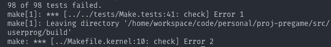

!!! abstract "前言"
    这里是 CS162 的学习笔记。


!!! tip "资料"
    - [cs-plan](https://cs-plan.com/%E5%9F%BA%E7%A1%80%E6%B7%B1%E5%85%A5/%E8%AF%BE%E7%A8%8B%E6%8E%A8%E8%8D%90/Systems/%E6%93%8D%E4%BD%9C%E7%B3%BB%E7%BB%9F/UCBCS162/): 该作者也讲述了关于他学习该课程的心得，并且自行编写了三个作业的测试脚本。

## 调试

CS162 的课程中，非常提倡使用 GDB 进行调试，如果一开始使用不是很熟练，使用 `stderr` 输出错误信息也是不错的选择。

```c
#define debug(fmt, ...) \
  fprintf(stderr, "Error at line %d: " fmt, __LINE__, ##__VA_ARGS__)
```

## 环境配置

Docker Destop 中打开将 Container 和 Images 运行起来后，使用以下命令行进行 docker 的开启。

```bash
❯ sudo docker-compose up -d
Password:
WARN[0000] /Users/mulberry/workspace/cs-learning/CS162/cs162-workspace/docker-compose.yml: the attribute `version` is obsolete, it will be ignored, please remove it to avoid potential confusion 
[+] Running 2/2
 ✔ Network cs162-workspace_default    Created                                                                                                                                                  0.0s 
 ✔ Container cs162-workspace-cs162-1  Started 
```



```bash
workspace@85831f7574ac [14:32:52] group $ git pull group0 main
From github.com:mulberror/cs162-group0
 * branch            main       -> FETCH_HEAD
fatal: refusing to merge unrelated histories
```

```bash
workspace@85831f7574ac [14:36:08] group $ git pull group0  main --allow-unrelated-histories
From github.com:mulberror/cs162-group0
 * branch            main       -> FETCH_HEAD
Auto-merging .gitignore
CONFLICT (add/add): Merge conflict in .gitignore
Auto-merging README.md
Automatic merge failed; fix conflicts and then commit the result.
```
