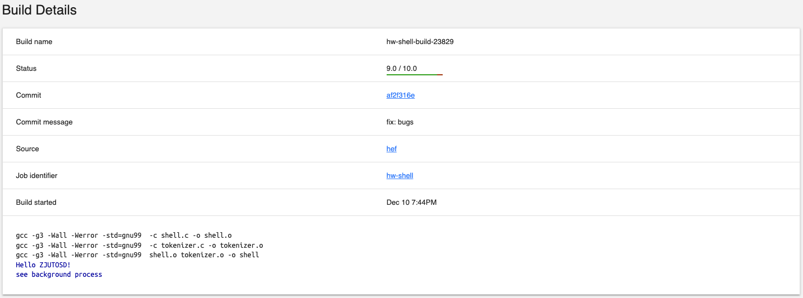
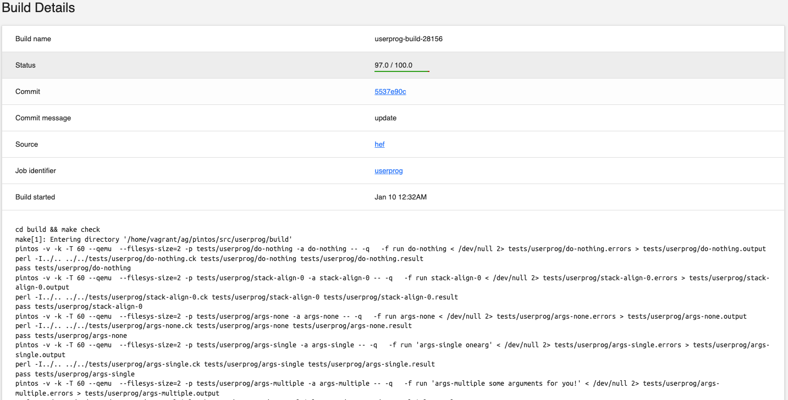

# 操作系统课程设计报告

姓名：张盛

学号：202203150728

## 0. 开发环境

- **操作系统**：Ubuntu（MacOS M1 Docker）
- **开发工具**：VS Code
- **编程语言**：C/C++
- **版本控制**：Git

## 1. Shell

### 1.1 实验内容

设计一个简单的shell程序，实现以下功能：

- **`cd` 命令**  
  实现目录切换功能，支持以下特性：
  - 切换到绝对路径或相对路径。
  - 处理特殊路径符号（如 `..` 表示上一级目录，`.` 表示当前目录）。
- **`pwd` 命令**  
  输出当前工作目录的绝对路径。
- **程序运行命令**
  - 允许用户通过指定路径和文件名执行非内置命令。
  - 在当前工作目录或给定的路径中查找目标程序并启动运行。
- **路径解析** 
  提供路径解析功能：
  - 支持处理相对路径和绝对路径。
  - 识别特殊路径符号（如 `..` 和 `.`）。
  - 验证路径合法性，避免执行错误路径的命令。
- **输入重定向 (`<`)**  
  从指定文件中读取程序输入。
- **输出重定向 (`>` 和 `>>`)**  
  - `>`：将程序输出写入指定文件（覆盖模式）。  
  - `>>`：将程序输出追加到指定文件（追加模式）。
添加对常见信号的捕获和处理：
  - `SIGINT`：用于中断程序。
  - `SIGTSTP`：暂停程序。
- 信号处理，提供响应机制：
  - 忽略信号。
  - 安全终止程序。
  - 执行其他自定义处理逻辑。
- 支持在命令末尾添加 `&` 符号，将命令置于后台执行。
- 提供后台任务管理功能：
  - 查询后台任务状态。
  - 终止指定的后台进程。

### 1.2 设计思路

本实验的主要目的是设计并实现一个简易的 shell 程序。通过模拟和实现类 Unix 环境下的 shell 行为，用户能够在该 shell 中执行内建命令、外部程序及支持输入输出重定向和管道功能。程序的设计思路可以分为以下几个核心模块：

1. **命令解析与执行**  
   - 首先，用户输入一行命令，程序通过 `tokenize` 函数将其拆分为多个“标记”（tokens），并根据这些标记解析出命令及其参数。
   - 如果命令是 shell 的内建命令，程序将调用相应的函数进行处理。如果命令是外部程序，程序将使用 `fork` 创建子进程来执行该程序。
   
2. **内建命令的处理**  
   - 在 shell 中实现了几个内建命令，包括 `exit`、`pwd`、`cd` 和 `help`，这些命令直接在 shell 内部执行，而不需要调用外部程序。
   - 为了简化命令的处理，内建命令被组织在一个查找表中，当用户输入命令时，程序会查找该命令并调用相应的处理函数。

3. **进程管理**  
   - 通过 `fork` 函数创建子进程，在子进程中执行用户命令。如果命令是外部程序，程序将通过 `execv` 执行程序。如果命令中包含管道（`|`），则通过管道将多个命令连接起来。
   - 通过父进程等待子进程的执行状态，确保 shell 程序能够正确处理进程的创建与销毁。

4. **输入输出重定向**  
   - 在命令解析过程中，如果用户输入了输入重定向（`<`）或输出重定向（`>`），shell 将重新定向标准输入或输出流到指定的文件。
   - 对于输入重定向，程序会使用 `freopen` 将标准输入指向指定文件；对于输出重定向，程序会将标准输出指向指定文件。

5. **管道支持**  
   - 为了支持管道操作，程序在解析命令时会根据 `|` 分隔符将多个命令分成不同的部分，并为每个部分创建一个独立的进程。
   - 使用 `pipe` 函数创建管道，并通过 `dup2` 将进程的标准输入输出连接到管道的读写端。

6. **信号处理**  
   - 为了避免在子进程中发生信号干扰，程序为子进程设置了合适的信号处理机制。子进程会忽略 `SIGINT` 和 `SIGTSTP` 信号，这样在执行过程中不会被中断或暂停。

### 1.3 主要实现

#### 1.3.1 主程序部分

```c
init_shell();

static char line[4096];
int line_num = 0;

if (shell_is_interactive)
  fprintf(stdout, "%d: ", line_num);

while (fgets(line, 4096, stdin)) {
  struct tokens* tokens = tokenize(line);
  int fundex = lookup(tokens_get_token(tokens, 0));

  if (fundex >= 0) {
    cmd_table[fundex].fun(tokens);
  } else {
    int status;
    pid_t pid = fork(); 
    
    if (pid > 0) {
      waitpid(pid, &status, 0);
    } else if (pid == 0) {
      set_child_signal_handlers(getpid());
      int tokens_total = tokens_get_length(tokens);
      if (tokens_total > MAX_TOKEN_SIZE || tokens_total <= 0) {
        exit(0);
      }
      static int n = 0; // process's number
      int *cmd_lengths = NULL;
      char ***args = split_tokens(tokens, tokens_total, &n, &cmd_lengths);

      int (*pipes)[2] = malloc((n - 1) * sizeof(*pipes));
      for (int i = 0; i + 1 < n; i++) {
        if (pipe(pipes[i]) == -1) {
          exit(1);
        }
      }

      for (int i = 0; i < n; i++) {
        pid_t pid = fork();
        if (pid == 0) {
          for (int j = 0; j + 1 < n; j++) {
            if (j != i - 1) {
              close(pipes[j][0]);
            }
            if (j != i) {
              close(pipes[j][1]);
            }
          }
          if (i > 0) {
            dup2(pipes[i - 1][0], STDIN_FILENO);
            close(pipes[i - 1][0]);
          }
          if (i + 1 < n) {
            dup2(pipes[i][1], STDOUT_FILENO);
            close(pipes[i][1]);
          }
          parse_exec(args[i], cmd_lengths[i]);
          exit(0);
        }
      }

      for (int i = 0; i + 1 < n; i++) {
        close(pipes[i][0]);
        close(pipes[i][1]);
      }

      for (int i = 0; i < n; i++) {
        wait(NULL);
      }

      exit(0); // because of fork !important
    } else {
      perror("fork failed");
      exit(1);
    }
  }

  if (shell_is_interactive)
    fprintf(stdout, "%d: ", ++line_num);

  tokens_destroy(tokens);
}
```

如以上代码所示，首先我们需要实现了一个基本的 shell 交互流程，主要功能包括读取用户输入、解析命令、执行内建命令、外部命令、管道操作及进程管理。

首先，通过调用 `init_shell()` 函数初始化 shell 环境，接着进入一个循环，使用 `fgets` 从标准输入读取每一行命令。若 shell 处于交互模式，则输出当前命令行号，以便用户查看。

在每次读取命令行后，调用 `tokenize(line)` 将输入的命令行分解为一系列的标记（tokens），然后使用 `lookup` 函数检查这些标记是否对应于内建命令的索引。如果 `lookup` 函数返回一个非负值，则意味着这是一个内建命令，程序调用 `cmd_table[fundex].fun(tokens)` 来执行相应的内建命令。

如果 `lookup` 函数返回的是负值，说明输入的是外部命令或程序，程序接着使用 `fork` 函数创建一个子进程来执行该命令。父进程通过 `waitpid` 等待子进程的执行结果。若 `fork` 调用成功且返回值为 0，子进程继续执行命令。若是外部命令，子进程会使用 `set_child_signal_handlers` 函数设置信号处理器，并进行命令的参数拆分，计算出命令的总数以及每个命令的参数长度。

为了支持管道操作，代码通过 `pipe` 函数创建管道并为每一对相邻的命令进程分配一个管道。创建管道后，程序通过循环启动多个子进程，每个子进程对应一个命令，并处理输入输出重定向。如果当前命令进程需要读取上一个命令的输出，就通过 `dup2` 将标准输入重定向到前一个管道的读取端；如果当前命令需要将输出传递给下一个命令，则将标准输出重定向到下一个管道的写入端。

在管道操作完成后，父进程通过 `wait` 等待所有子进程执行完毕，确保所有命令都已被正确执行。若遇到任何异常，如 `fork` 调用失败，程序会输出错误信息并终止执行。

#### 1.3.2 执行命令处理

```c
int parse_exec(char **args, int token_total) {
  if (args == NULL) {
    return 0;
  }
  char *input_file = NULL, *output_file = NULL, *prog = NULL;
  char **argv = malloc(token_total * sizeof(char *));
  int argn = 0;

  for (int i = 0; i < token_total; i++) {
    if (strcmp(args[i], "<") == 0) {
      input_file = args[i + 1];
      i++;
    } else if (strcmp(args[i], ">") == 0) {
      output_file = args[i + 1];
      i++;
    } else {
      if (prog == NULL) {
        prog = args[i];
      }
      argv[argn++] = args[i];
    }
  }

  char **new_args = malloc((argn + 1) * sizeof(char *));
  if (args == NULL) {
    perror("malloc failed");
    free(argv);
    return -1;  // 内存分配失败
  }

  for (int i = 0; i < argn; i++) {
    new_args[i] = argv[i];
  }
  new_args[argn] = NULL;
  int result = -1;

  if (input_file != NULL || output_file != NULL) {
    result = redirect_exec(prog, new_args, input_file, output_file);
  } else {
    result = prog_exec(prog, new_args);
  }
  free(argv);
  return result;
}
```
`parse_exec` 函数负责解析并执行命令，且支持输入输出重定向功能。该函数接收两个参数：`args` 为命令的参数列表，`token_total` 为命令中标记的总数。函数首先检查 `args` 是否为空，若为空则直接返回 0。

函数内部定义了三个变量：`input_file`、`output_file` 和 `prog`，分别用于存储输入文件名、输出文件名和程序名。接着，为了存储有效的命令参数，程序动态分配了一个 `argv` 数组，并初始化一个变量 `argn` 来跟踪有效参数的数量。

在参数解析过程中，函数通过遍历 `args` 数组，查找输入重定向符号 `<` 和输出重定向符号 `>`。若遇到 `<`，则将其后一个参数视为输入文件并跳过；若遇到 `>`，则将其后一个参数视为输出文件并跳过。如果遇到其他情况，认为该参数为程序名或执行参数，并将其加入 `argv` 数组。

在完成命令参数的解析后，程序为 `new_args` 动态分配内存，并将有效参数从 `argv` 复制到 `new_args` 中，最后在 `new_args` 数组末尾添加一个 `NULL` 作为参数列表的结束标志。

接下来，程序根据是否存在输入文件或输出文件来选择执行方式。若存在输入输出重定向，则调用 `redirect_exec` 函数执行带重定向的命令；否则，调用 `prog_exec` 函数执行普通命令。`redirect_exec` 和 `prog_exec` 是两种不同的命令执行方式，分别处理带重定向和不带重定向的命令。

在执行完命令后，函数释放分配的内存并返回执行结果。若内存分配失败，程序会输出错误信息并返回 `-1`，表示执行失败。

### 1.4 测试结果

根据以上设计并进行具体实现，最终可以得到一个简易的 shell 程序，以下是在测评网站上对该程序的测试结果：



### 1.5 实验总结

本实验的目标是实现一个支持管道和输入输出重定向的简单命令解析器。通过本实验的实现，我们了解并实践了如何使用系统调用（如 `fork`、`exec`、`pipe`、`dup2` 等）来实现多进程的命令执行，如何在命令执行过程中处理输入输出重定向，以及如何使用管道在多个命令之间传递数据。

在实验中，我们设计并实现了以下几个关键组件：

1. **命令解析器**：通过 `parse_exec` 函数解析命令行输入，处理输入文件、输出文件、程序名和参数列表，确保能够正确解析命令的各个部分。
2. **进程管理**：使用 `fork` 创建子进程，并通过 `exec` 系列函数执行实际的命令。通过多重 `fork` 实现管道机制，将多个命令链接起来，形成一个命令链。
3. **输入输出重定向**：通过检查命令中的 `<` 和 `>` 符号，决定是否需要进行输入输出重定向操作。如果需要，使用 `dup2` 重定向标准输入输出流到指定文件。
4. **管道机制**：使用 `pipe` 创建管道，在多个子进程之间传递数据。每个子进程根据管道的位置来调整输入输出流，保证数据流畅地从一个命令传递到下一个命令。

实验的关键难点在于如何处理多重命令的顺序执行和输入输出的正确重定向，尤其是在涉及到多个管道时，如何管理进程间的数据流。通过合理的资源管理（如管道、文件描述符的关闭与重定向），我们成功地实现了多个命令的串联执行。

通过本实验，我们加深了对操作系统进程管理、系统调用及其在命令解析中的应用的理解。同时，我们也掌握了如何处理命令执行中的异常情况，如内存分配失败、命令解析错误等，并能够对其做出相应的错误处理。

综上所述，本实验不仅提高了我们的编程能力，也帮助我们更深入地理解了操作系统中进程与文件描述符的管理、输入输出重定向以及管道的使用，为今后更复杂的系统编程打下了坚实的基础。

## 2. Userprog

### 2.1 userprog实验内容

本实验主要涉及三项内容：参数传递、进程控制系统调用和文件操作系统调用。在参数传递部分，我们实现了命令行参数的解析与传递，确保参数能够从父进程正确地传递到子进程，尤其是在处理管道和重定向时。此外，进程控制部分实现了`fork`、`exec`和`wait`等关键系统调用，确保了进程的创建、执行和同步。最后，文件操作系统调用的实现让进程能够正确地进行文件的打开、读取、写入和关闭，确保了文件资源的有效管理和操作。通过这些功能的实现，我们能够更好地理解操作系统的进程管理和文件操作机制。

### 2.2 主要功能

#### 2.2.1 参数传递

| 地址       | 命名             | 数据        | 类型    |
| :--------- | ---------------- | ----------- | ------- |
| 0xbffffffc | argv\[3\]\[...\] | “bar\0”     | char[4] |
| 0xbffffff8 | argv\[2\]\[...\] | “foo\0”     | char[4] |
| 0xbffffff5 | argv\[1\]\[...\] | “-l\0”      | char[3] |
| 0xbfffffed | argv\[0\]\[...\] | "/bin/ls\0” | char[8] |
| 0xbfffffec | word-align       | 0           | uint8_t |
| 0xbfffffe8 | argv[4]          | 0           | char *  |
| 0xbfffffe4 | argv[3]          | 0xbffffffc  | char *  |
| 0xbfffffe0 | argv[2]          | 0xbffffff8  | char *  |
| 0xbfffffdc | argv[1]          | 0xbffffff5  | char *  |
| 0xbfffffd8 | argv[0]          | 0xbfffffed  | char *  |
| 0xbfffffd4 | argv             | 0xbfffffd8  | char ** |
| 0xbfffffd0 | argc             | 4           | int     |

<center>表1：栈空间参数定义</center>

在对Pintos的代码和相关文档进行深入研究后，我们了解到用户程序的命令输入会先经过`process_execute`函数处理。该函数通过调用`thread_create(s_exe, PRI_DEFAULT, start_process, fn_copy)`，将命令传递到`start_process`函数进行后续处理。通过这一流程，我们能够为执行用户程序准备必要的环境，并将用户提供的命令与参数传递到正确的执行上下文中。

在`process_execute`函数中，最重要的工作是处理线程的创建及其相应的参数传递。此时，我们不仅要创建无参的线程，还要从令牌中提取出用户输入的文件名，这一过程是为后续加载用户程序做准备。文件名在整个过程中扮演着重要的角色，因为它标识了要加载的程序。

然而，在`start_process`中执行`load`函数之前，我们需要确保用户传递的参数能够正确地压入栈中，并符合内存对齐要求。为此，我设计了一个名为`align`的函数，它确保栈空间的处理符合Pintos文档中的要求。该函数的输入包括文件名，即用户输入的命令行程序名称。

首先，我们使用`strtok_r`函数对文件名进行处理，将文件名中的命令行参数以空格为分隔符进行分割。每一个分割后的参数将被压入栈中。在每次压栈时，栈指针`re->esp`会向下移动，直到所有参数都被正确存放。与此同时，我们使用`strlcpy`函数将每个参数的内容复制到栈中，确保栈内存能够正确存储每个参数。

在完成参数存放后，我们会记录下总的参数个数`argc`，并根据这些参数以及栈空间的布局调整栈指针。此时，我们也会清空栈上的冗余空间，以保证栈指针`re->esp`能够满足16字节对齐的要求。这一点非常重要，因为内存对齐是确保栈访问和程序运行稳定性的关键因素之一。

接下来，我们会在栈中依次存储三个关键信息：参数个数、指向参数的指针数组、以及这些指针的实际存储地址。为了确保参数能够正确传递，我们会从用户程序栈的高地址开始向回溯，逐一定位每个参数的起始位置，并将这些位置存储到指针数组中。最后，在完成所有压栈操作后，我们会对栈指针做最后的调整，确保在程序启动时栈空间正确返回给调用者。具体代码如下所示

```c
static void align(struct intr_frame* re, char* file_name) {
  int argc = 0;
  void* initial_esp = re->esp;
  char* tokenized_str;

  for (char* param = strtok_r(file_name, " ", &tokenized_str); param != NULL; param = strtok_r(NULL, " ", &tokenized_str)) {
    re->esp -= strlen(param) + 1;
    strlcpy(re->esp, param, strlen(param) + 1);
    argc++;
  }

  void* params_start = re->esp;
  re->esp -= (argc + 2) * sizeof(char*);
  re->esp -= sizeof(int);

  re->esp = (void*)((unsigned int)re->esp & 0xFFFFFFF0);
  memset(re->esp, 0, params_start - re->esp);

  void* params_end = re->esp;
  *(int*)re->esp = argc;
  re->esp += sizeof(int);
  *(char***)re->esp = re->esp + sizeof(char**);
  re->esp += sizeof(char**);

  char* param_ptr = (char*)initial_esp - 2;
  while (param_ptr > (char*)params_start) {
    if (*param_ptr == 0) {
      *(char**)re->esp = param_ptr + 1;
      re->esp += sizeof(char*);
    }
    param_ptr--;
  }

  *(char**)re->esp = param_ptr;

  re->esp = params_end;
  re->esp = (void*)((void**)re->esp - 1);
  *(void**)re->esp = NULL;
}
```

#### 2.2.2 进程控制

在本部分的任务是实现四个系统调用：`halt`、`exit`、`exec` 和 `wait`。

首先，我们需要了解系统调用的实现位置。经过查阅文档，我们发现系统调用都是通过 `syscall_init` 函数来初始化的。在该函数中，核心的实现依赖于 `syscall_handler` 函数。这个函数通过检查系统调用的类型，选择相应的分支来调用对应的系统调用功能。

确认了系统调用的入口后，我们可以着手实现这四个系统调用。对于 `halt`，我们只需调用现有的 `shutdown_power_off()` 函数来关闭系统。而 `exit` 调用则相对简单，我们可以直接使用类似的方式来完成。

对于 `exec` 和 `wait`，我们需要更多的工作。在 `exec` 中，我们需要加载一个新的程序，并将其参数传递给新的程序。这一过程需要调用 `process_execute` 函数，并在其中调用 `load` 函数来加载新的程序。在 `wait` 中，我们需要等待一个子进程的结束，并返回其退出状态。这一过程需要调用 `process_wait` 函数，并在其中调用 `sema_down` 函数来等待子进程的结束。

具体来说，`exec` 功能的实现是在 `process_execute` 函数中完成的。该函数的主要任务是创建一个子线程来执行指定的程序，并进行相关的初始化处理。

首先，为了避免在调用 `load` 函数时发生竞态条件，`process_execute` 会调用 `palloc_get_page` 来分配一页物理内存，并存储传入的 `file_name` 副本。这一副本将作为后续操作的安全保证。然后，使用 `thread_create` 创建一个新线程，新线程将执行名为 `file_name` 的程序。此时，线程的入口函数为 `start_process`，并将拷贝的 `fn_copy` 作为参数传递给新线程。

在新线程创建后，当前线程通过调用 `sema_down` 进行阻塞，等待新线程完成程序加载。这一等待机制通过向线程列表中添加名为 `it` 的节点来实现同步。若新线程成功加载程序，返回该新线程的线程ID（`tid`），否则返回错误码 `TID_ERROR`。

如果加载成功，新线程的线程ID将被添加到当前线程的子进程列表中，并且相关信息将被更新。如果加载失败，子进程信息的状态会被设置为 -1，并释放相关资源。最终，`process_execute` 函数将返回子线程的线程ID或加载失败的错误信息。

具体代码如下所示：

```c
pid_t process_execute(const char* file_name) {
  char* fn_copy;
  tid_t tid;
  fn_copy = palloc_get_page(0);
  if (fn_copy == NULL)
    return TID_ERROR;

  strlcpy(fn_copy, file_name, PGSIZE);
  size_t len = strcspn(file_name, " \0") + 1;
  char *s_exe = (char*)malloc(len * sizeof(char));
  strlcpy(s_exe, file_name, len);

  tid = thread_create(s_exe, PRI_DEFAULT, start_process, fn_copy);
  if (tid == TID_ERROR)
    palloc_free_page(fn_copy);
  free(s_exe);

  in_node* it = add_list(tid);
  sema_down(&(it->kk));

  pid_t res = tid;
  if (!(it->is_in)) {
    res = -1;
  }

  struct thread* my_t1 = thread_current();
  child_info* itt = add_ch(&(my_t1->pcb->l_of_cld), tid);

  if (res == -1) {
    itt->st = -1;
    sema_up(&(itt->fa));
    remove_list(tid);
  } else {
    it->pcb->nxt_p = my_t1->pcb;
    sema_up(&(it->ch));
  }

  return res;
}
```

在`wait`的功能实现中，核心部分位于`process_wait`函数中。该函数的主要任务是等待一个指定子进程的执行结束，获取其终止状态，并在终止后移除该子进程的信息。

函数开始时，通过`List_of_child`函数查找当前线程的子进程列表，获取关于指定子进程ID（`child_pid`）的信息。如果找到对应的子进程信息，将返回指向该子进程信息的结构体指针（`child_info* ch`）。一旦确认存在该子进程，接下来就需要通过调用`sema_down`来阻塞当前线程，等待子进程的执行结束。该阻塞操作通过访问子进程信息中的信号量（`fa`）来实现，直到子进程执行结束时，信号量才会被释放，从而唤醒被阻塞的父进程。

当父进程被唤醒时，说明子进程已经执行结束，此时可以从子进程信息中获取其终止状态（`int res = ch->st;`）。获取到终止状态后，通过调用`remove_ch`函数，从父进程的子进程列表中移除已结束的子进程信息。最终，`process_wait`函数返回子进程的终止状态。

这一过程的实现保证了父进程能够正确地等待和处理子进程的终止状态，并确保子进程信息在处理完成后被清理，避免资源泄露。具体实现代码如下所示。

```c
int process_wait(pid_t child_pid) {
  struct thread* my_t1 = thread_current();
  child_info* ch = List_of_child(&(my_t1->pcb->l_of_cld), child_pid);
  if (ch) {
    sema_down(&ch->fa);  
    int res = ch->st;    
    remove_ch(&(my_t1->pcb->l_of_cld), child_pid); 
    return res; 
  }
  return -1; 
}
```

#### 2.2.3 文件操作

该部分实现了与文件相关的系统调用，包括 `create`、`remove`、`open`、`filesize`、`read`、`write`、`seek`、`tell` 和 `close` 等操作。通过查阅资料和阅读文档，我发现pintos中已经实现了这些文件操作的底层函数，我们的任务是对这些函数进行封装，调整上下文，并处理一些细节，比如参数有效性检查和互斥锁的使用。

在本实验中，各个功能的实现大同小异，主要区别在于如何处理文件操作时的不同需求。以 `read` 操作为例，来说明其设计思路和实现流程。

`read` 系统调用的目标是从文件中读取数据。在实现时，我们需要处理以下几个关键步骤：

1. **参数验证**  
   在开始读取之前，首先需要检查传入参数的有效性。我们会验证 `sz`（读取的字节数）是否在合理的范围内，确保它大于等于 0 且小于文件表的大小。如果参数不符合条件，则返回 -1 表示错误。

2. **获取文件锁**  
   为了确保文件的读取操作是互斥的，我们需要使用全局文件锁。通过调用 `lock_acquire(&mylock)` 获取锁，从而确保不会有多个线程同时访问文件，避免发生数据竞争或读取错误。

3. **检查文件是否存在**  
   在文件表中检查目标文件是否存在，索引值为 `sz`。如果文件不存在，我们需要释放文件锁并返回 -1，表示文件操作失败。

4. **执行文件读取**  
   一旦确认文件存在并且参数有效，就可以调用已有的 `file_read` 函数执行读取操作。读取的字节数会保存在 `sz_` 变量中，并存储到缓冲区 `buf` 中。

5. **释放文件锁**  
   文件读取操作完成后，我们通过调用 `lock_release(&mylock)` 释放锁，使其他线程可以访问文件。

具体实现如下所示：

```c
static int sy_read(int sz, void *buf, int sz_) {
  if (sz < 0 || sz >= FT_SZ) {
    return -1;
  }

  if (sz == 0) {
    return input_getc();
  }

  struct thread *my_t1 = thread_current();
  struct process *pcb = my_t1->pcb;

  lock_acquire(&mylock);

  if (!(pcb->tbl_f[sz])) {
    lock_release(&mylock);
    return -1;
  }

  int res = file_read(pcb->tbl_f[sz], buf, sz_);

  lock_release(&mylock);
  return res;
}

static void syscall_handler(struct intr_frame *f UNUSED) {
  int args[4];

  ...
  else if (args[0] == SYS_READ) {
    ok_argv(args + 1, 3);
    ok_buf((void*)args[2], (size_t)args[3]);

    f->eax = sy_read((int)args[1], (void*)args[2], (unsigned int)args[3]);
  }
  ...
}
```

### 2.3 测试结果

根据以上设计并进行具体实现，最终就可以完成 userprog 相关要求，以下是在测评网站上对该程序的测试结果：



### 2.4 实验总结

本实验的目标是实现一个支持参数传递、进程控制和文件操作的用户程序。通过本实验的实现，我们了解并实践了如何使用系统调用（如 `fork`、`exec`、`wait`、`open`、`read`、`write` 等）来实现进程的创建、执行和同步，以及文件的打开、读取、写入和关闭等操作。

通过这次实验，我对操作系统的底层实现有了更深入的理解。我学到了如何处理用户程序的栈布局、系统调用的实现以及与文件系统的交互。在解决问题的过程中，我意识到系统调用的文档和注释起到了至关重要的作用。与此同时，进行充分的测试和调试也是确保系统调用正确性的重要步骤。在未来，我计划继续深入研究操作系统的相关理论，并尝试更复杂的实验。这次实验为我提供了宝贵的机会，使我能够更好地理解操作系统的内部工作原理，并提升了我的编程和调试能力。

## 3. 专业认证总结

### 3.1 对专业知识基本概念、基本理论和典型方法的理解

操作系统作为计算机系统中的核心软件，负责管理硬件资源并提供基础服务支持。其基本概念涵盖了进程、线程、存储管理、文件系统和设备管理等多个方面。进程是操作系统资源分配的基本单位，线程则是更细粒度的执行单位，二者共同实现了程序的并发运行。存储管理包括内存分配与回收、地址映射和虚拟内存技术，用于优化存储资源的使用效率。文件系统通过逻辑结构将数据组织为文件和目录，提供了方便的持久化存储机制。设备管理则负责协调外部设备的访问，屏蔽硬件差异并提供统一接口。

操作系统的基本理论主要包括并发控制、同步机制以及死锁处理等，确保系统能够在多任务环境中高效运行。其中，经典同步机制如信号量、互斥锁和条件变量等，是解决进程或线程间竞争与协作的重要工具。虚拟化技术通过抽象底层硬件资源，增强了系统的可扩展性和资源利用率。

在我进行设计与实现操作系统时，常用的典型方法包括分层设计、模块化编程以及面向对象的思想。这些方法确保了系统的结构清晰、功能易于扩展和维护，同时也能提高系统运行的稳定性和可靠性。通过理解这些概念与方法，可以更好地掌握操作系统设计的核心思想，为复杂计算机系统的开发奠定基础。

### 3.2 如何建立模型

建立模型是分析操作系统行为与优化设计的重要手段，通常分为需求分析、抽象设计和验证优化三个阶段。首先，通过明确系统目标和约束条件（如资源利用率和任务调度效率），提炼出核心问题，并定义模型的基本要素，如进程、内存块或文件节点等。

设计模型时，可选用适合的方法，例如用有限状态机描述系统状态，采用排队论分析调度性能，或以图结构模拟资源分配和文件系统层次关系。针对内存管理，构建虚拟地址与物理地址的映射模型；对于文件系统，设计层级化的目录模型。

模型完成后，通过算法分析、仿真实验或逻辑验证验证其正确性与效率，并结合启发式算法或动态调整优化性能。精确的模型能更好地揭示操作系统的运行机制，为系统开发与优化提供理论支持。

### 3.3 如何利用基本原理解决复杂工程问题

利用操作系统的基本原理解决复杂工程问题，需要充分理解其核心理论，并将这些理论应用于实际场景中。操作系统中的每个核心模块，例如进程管理、存储管理和设备管理，都为工程问题的解决提供了基础工具和方法。

在进程调度中，通过利用优先级调度、时间片轮转和多级反馈队列等算法，可以优化 CPU 的使用效率，确保多任务环境下的公平性与响应速度。在内存管理中，分页和分段技术结合虚拟内存理论，能够高效解决内存分配、碎片化和进程隔离等问题，从而支持大规模、多任务的并发运行。

并发与同步是复杂工程问题的另一个重点。通过应用信号量、互斥锁和条件变量等机制，可以解决线程间的竞争与协作问题，确保共享资源的安全使用。对于可能出现的死锁问题，资源分配图和死锁检测算法提供了强有力的分析和处理手段，而银行家算法则通过动态分配资源有效预防死锁。

通过将这些基本原理与实际需求相结合，能够对复杂问题进行分解和抽象，并制定出清晰的解决路径。理论与实践的结合不仅能解决当下问题，也为后续的系统扩展和优化提供了可靠的基础。

### 3.4 具有实验方案设计的能力

实验方案设计能力是解决复杂问题的重要技能，通过合理规划实验目标、设计流程和分析结果，验证系统的功能与性能。首先，需要明确实验目标，例如评估调度算法的效率或验证内存管理策略的效果。根据目标设计输入输出和关键变量，如进程数量、优先级或内存使用情况。

实验方案应明确实验环境，包括硬件配置、系统版本和测试工具，同时控制变量以确保结果可信性。在并发与同步问题中，构造多线程竞争场景，并使用日志或性能分析工具收集数据。多组对比实验是分析不同策略优劣的有效手段，同时通过重复试验降低误差影响。

通过科学的实验方案设计，可以验证理论的正确性，优化系统实现，并为复杂问题的解决提供数据支持。

### 3.5 如何对环境和社会的可持续发展

操作系统的设计与实验不仅关注技术性能，还与环境和社会的可持续发展密切相关。在操作系统实验中，如何减少能耗、提高资源利用率以及支持多样化硬件平台，成为设计的重要考虑因素。

合理的任务调度可以有效降低处理器负载，减少不必要的计算消耗，进而降低能源消耗。例如，采用动态调整 CPU 使用率的算法，优先处理高优先级任务，避免不必要的空闲周期，从而实现节能。

通过引入虚拟内存和容器化技术，能够在同一硬件上运行多个轻量级进程，减少对硬件资源的需求，延长硬件使用寿命，降低电子废弃物的产生。

最后，操作系统的设计应考虑普适性与公平性，保证不同社会群体和地域的用户都能平等地访问和使用计算资源。通过开放源代码、提升操作系统的易用性与可访问性，推动技术的普及和社会进步。