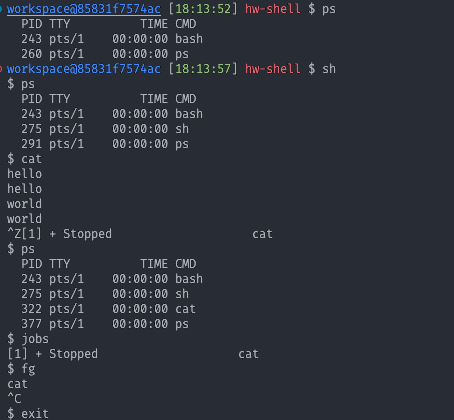

## Program Execution: 程序执行

使用 `tokenizer.h` 中的代码，

## Redirection：重定义

该问题

Be aware that < [file] or > [file] are not passed as arguments to the program (i.e. you will not find these characters in the argv argument of the main function in shell.c).

我一开始将这个问题想复杂了，使用 `pipe` 的方法来完成了，一开始的思路是这个前面的输入流要传给后面的程序。

但是其实实际上本身只有一个程序，所以只需要将输入输出重定向到文件就可以了。

```c
int pipefd[2];
if (pipe(pipefd) == -1) {
  perror("pipe");
  exit(1);
}
pid = fork();
if (pid == -1) {
  perror("fork");
  exit(1);
}
if (pid == 0) {
  FILE *input_file = NULL, *output_file = NULL;
  if (input_filename != NULL) {
    input_file = fopen(input_filename, "r");
    if (input_file == NULL) {
      perror("open input file");
      exit(1);
    }
    int input_fd = fileno(input_file);
    dup2(input_fd, STDIN_FILENO);
    fclose(input_file);
  }
  if (output_filename != NULL) {
    output_file = fopen(output_filename, "w");
    if (output_file == NULL) {
      perror("open output file");
      exit(1);
    }
    int output_fd = fileno(output_file);
    dup2(output_fd, STDOUT_FILENO);
    fclose(output_file);
  }

  prog_exec(prog_path, args);
  perror("program exec");
  exit(1);
}
wait(NULL);
return 0;
```

## Pipe

```c
char*** split_tokens(struct tokens* tokens, int tokens_total, int* n,
                     int** cmd_lengths) {
  // 为存储所有令牌分配内存
  char** arg = (char**)malloc(tokens_total * sizeof(char*));
  *n = 1; // 初始化命令数量

  // 复制令牌到 arg 数组，并计算 '|' 的个数
  for (int i = 0; i < tokens_total; ++i) {
    int token_length = strlen(tokens_get_token(tokens, i)) + 1;
    arg[i] = (char*)malloc(token_length);
    strcpy(arg[i], tokens_get_token(tokens, i));

    if (strcmp(arg[i], "|") == 0) {
      (*n)++; // 如果遇到 '|', 则命令数量加 1
    }
  }

  // 为分割后的命令数组分配内存
  char*** args = (char***)malloc((*n) * sizeof(char**));
  *cmd_lengths = (int*)malloc((*n) * sizeof(int)); // 分配命令长度数组
  int current_cmd = 0; // 当前命令的索引
  int cmd_len = 0; // 当前命令的令牌数

  // 遍历令牌，按 '|' 分割
  for (int i = 0; i < tokens_total; i++) {
    if (strcmp(arg[i], "|") == 0) {
      // 为当前命令分配准确的内存
      args[current_cmd] = (char**)realloc(args[current_cmd],
                                          (cmd_len + 1) * sizeof(char*));
      // +1 为 NULL
      args[current_cmd][cmd_len] = NULL; // 结束当前命令
      (*cmd_lengths)[current_cmd] = cmd_len; // 记录当前命令的令牌数
      current_cmd++; // 转到下一个命令
      cmd_len = 0; // 重置命令长度
    } else {
      // 为当前命令分配令牌
      args[current_cmd] = (char**)realloc(args[current_cmd],
                                          (cmd_len + 2) * sizeof(char*));
      // +1 为 NULL
      args[current_cmd][cmd_len] = arg[i]; // 将令牌加入当前命令
      cmd_len++;
    }
  }

  // 处理最后一个命令
  args[current_cmd] = (char**)realloc(args[current_cmd],
                                      (cmd_len + 1) * sizeof(char*));
  // +1 为 NULL
  args[current_cmd][cmd_len] = NULL; // 结束最后一个命令
  (*cmd_lengths)[current_cmd] = cmd_len; // 记录最后一个命令的令牌数

  // 释放临时存储的 arg
  free(arg);

  return args;
}
```

```c
#include <stdio.h>
#include <stdlib.h>
#include <unistd.h>
#include <string.h>

#define debug(fmt, ...) \
  fprintf(stderr, "Error at line %d: " fmt, __LINE__, ##__VA_ARGS__)

int main() {
  int pipes[2][2];
  pid_t pid1, pid2;

  // 创建两个管道
  if (pipe(pipes[0]) == -1) {
    perror("pipes[0]");
    exit(1);
  }
  if (pipe(pipes[1]) == -1) {
    perror("pipes[1]");
    exit(1);
  }

  if ((pid1 = fork()) == 0) {
    // 关闭 pipes[0] 的读端
    close(pipes[0][0]);
    // 将标准输出重定向到 pipes[0] 的写端
    // debug("%d %d\n", pipes[0][1], STDOUT_FILENO);
    dup2(pipes[0][1], STDOUT_FILENO);
    // debug("%d %d\n", pipes[0][1], STDOUT_FILENO);

    // 执行 echo 命令
    execlp("cat", "cat", "file.txt", (char *)NULL);
    perror("execlp echo");
    exit(1);
  }

  if ((pid2 = fork()) == 0) {
    // 关闭 pipes[0] 的写端和 pipes[1] 的读端
    close(pipes[0][1]);
    close(pipes[1][0]);

    // 将 pipes[0] 的读端重定向为标准输入
    dup2(pipes[0][0], STDIN_FILENO);
    // 将 pipes[1] 的写端重定向为标准输出
    dup2(pipes[1][1], STDOUT_FILENO);
    close(pipes[0][0]);
    close(pipes[1][1]);

    execlp("grep", "grep", "pattern", (char *)NULL);
    perror("execlp grep");
    exit(1);
  }

  // 关闭 pipes[0] 和 pipes[1] 的不必要的端口
  close(pipes[0][0]);
  close(pipes[0][1]);
  close(pipes[1][1]);

  // 将 pipes[1] 的读端重定向为标准输入
  dup2(pipes[1][0], STDIN_FILENO);
  close(pipes[1][0]);

  // 执行 wc -l 命令
  execlp("wc", "wc", "-l", (char *)NULL);
  perror("execlp wc");
  exit(1);

  return 0;
}
```

```txt
Error at line 27: 4 1
Error at line 29: 4 1
       2
```

## Signal Handling



### Process Group

检索进程 ID pid 或者进程组 ID pgid

- `pid_t getpid()` ：获取调用进程的进程 ID
- `pid_t getppid()` ：获取调用进程的父进程 ID
- `pid_t getpgrp()` ：获取调用进程的进程组 ID
- `pid_t getpgid(pid_t pid)` ：获取 pid 标识的进程的进程组 ID

